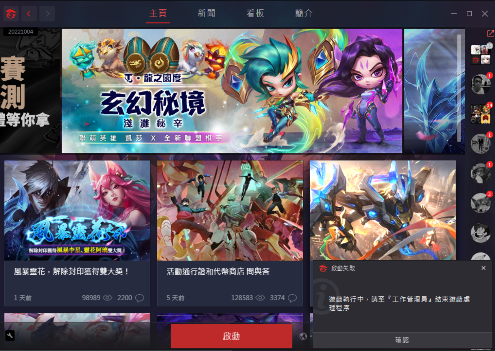

# goodGarena
Garena 競時通順暢開遊戲小補丁

## 問題定義

台灣版英雄聯盟需由 Garena 競時通按下「啟動」來對背景服務 `gxxsvc.exe` 
進行 IPC 溝通來透過 `CreateProcessEx` 喚醒 Riot 原廠的 LOL 遊戲大廳... 不過 Garena 寫得很爛 ^^ 

經常遇到 LOL 遊戲異常崩潰等情況、但 LOL 背景服務沒關乾淨，因此 Garena 競時通會誤以為遊戲還在進行中、所以不讓你創建新的 LOL 遊戲大廳。

## 本專案解法
通過逆向工程可以發現 Garena 競時通基於 QT5 撰寫，底層調用了自行開發的 `commutil.dll` 內部串 google IPC 模組進行溝通。
並且可以發現此模組導出函數 `ProcessHelper::checkProcessRunning(WCHAR* exeName)` 用於檢查指定 Process 是否存活。
在每次 Garena 確認遊戲是否存活前會先比對 `gxxapphelper.exe` 是否存活，因此對這個函數掛鉤就可以在用戶按下「啟動鍵」的當下將背景 LOL 背景程式關乾淨。

## 使用方式
解壓縮後有三份文件 `dllPatch.dll`, `goodGarena.sdb` 與 `RunMe.bat` 

對 `RunMe.bat` 右鍵以工作管理員執行安裝即可上補丁：
(1.) 將會把 `dllPatch.dll` 拷貝至 `C:\30cm_tw\goodGarena.dll`
(2.) 並安裝 `goodGarena.sdb` 來對 `Garena.exe` 自動注入 `goodGarena.dll` 

補丁僅需執行一次永久有效（即便 Garena 版本更新）重開機也不必再次執行補丁工具
每次 Garena 啟動後會有一聲 500ms 的 Beep 聲通知你當前 Patch 已被掛載 :)

  
